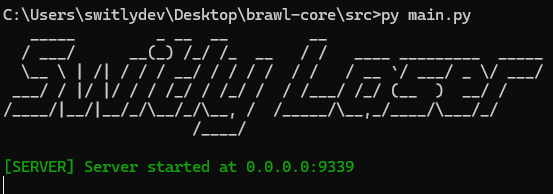

# Switly.Laser

A simple server core written in Python for Supercell's Brawl Stars game

# What is it?

This core allows you to connect to the patched brawl stars client using the tcp protocol.


# Requirements

- python 3.10
- patched Brawl Stars client (If you research, you can find many. If you try to do it yourself, you will need some reverse engineering knowledge.)

# How to Run

- After obtaining the required package structures, implant them into the project
- After that, download the server and extract the server file from the archive.
- In the `config.json` file in the server folder, change the `ServerIP` and `ServerPort` sections as follows.

```json
{
  "ServerIP": "0.0.0.0",
  "ServerPort": 9339
  // continuation of the file...
}
```

- Fill in the `ClientMajor` and `ClientMinor` sections in the `config.json` file according to the client version you want to use. For example, if your client version is `36.218`, fill in as follows.

```json
{
  "ClientMajor": 36,
  "ClientMinor": 218
  // continuation of the file...
}
```

- Download required Python libraries.

```bash
pip install -r requirements.txt
```

- Run `src/main.py` and Run the main.py command and enter the client that matches the packet structure.
- Have Fun!

# Thanks To

- [Classic Brawl](https://github.com/PhoenixFire6934/Classic-Brawl) for ByteStream logic.
